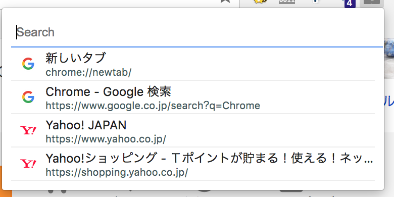
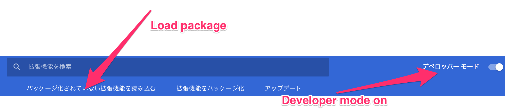

## chrome-tab-list

### How to use
1. Click extension icon or hit key (Command + 1)
2. Tab list appear
    
3. Input search query
4. Click tab you want to see

### How to install
1. Open extansion page.  
    [chrome://extensions/](chrome://extensions/)
2. Developer mode on.
3. Load extension.
    
